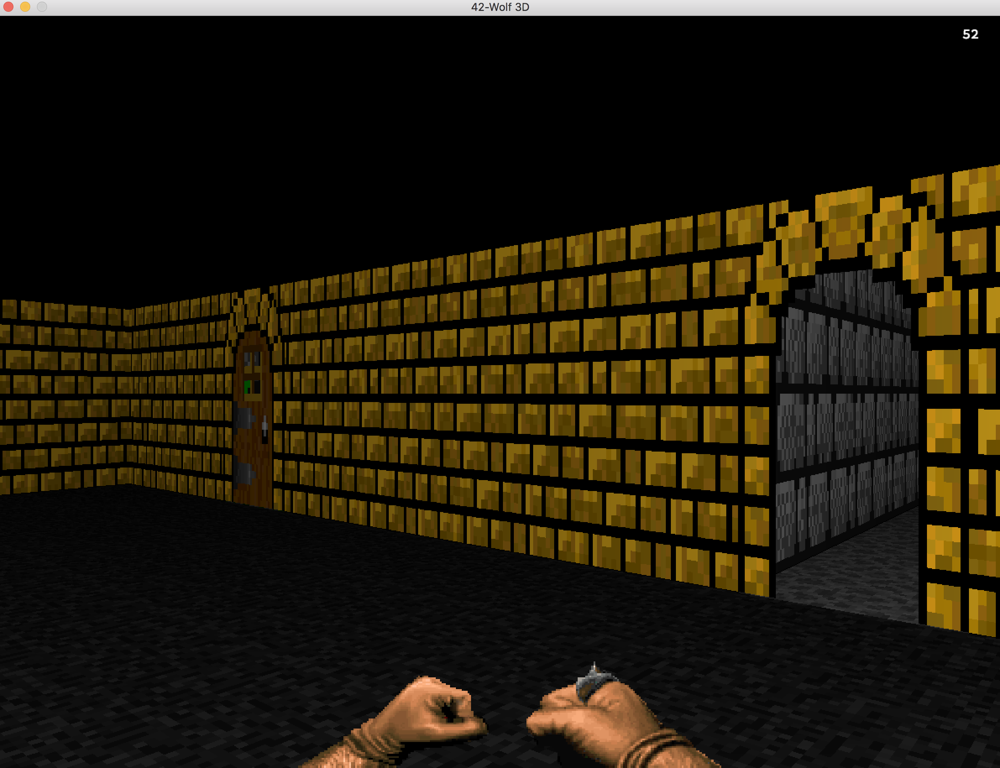

## Wolf3D

by Pablo Alatorre-Troncoso

## Overview

This is a project for 42 USA that asks you to make a ray-casting engine similar to that of Wolfenstein 3D, with any bonus features to be added by the student. I decided to add:
```
* Random dungeon generation
* Floor and wall textures
* Doors which can be opened (or punched open)
* Wall collision
* Three degrees of motion
* Multi-threaded optimization
```


